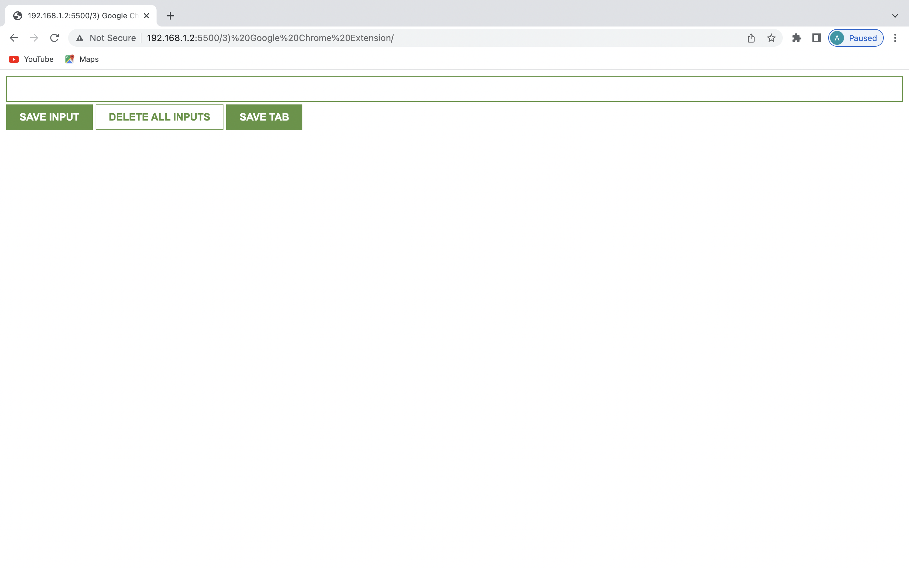

# About This Project

Google Chrome Extension which saves input given by the user, deletes the input and saves the URL of the current tab of browser window.

## Motivation

> Learning JavaScript through projects.

### Concepts Learned In The Project

- const
- addEventListener()
- innerHTML
- input.value()
- function parameters
- template strings
- localStorage
- The JSON object
- object in Arrays
